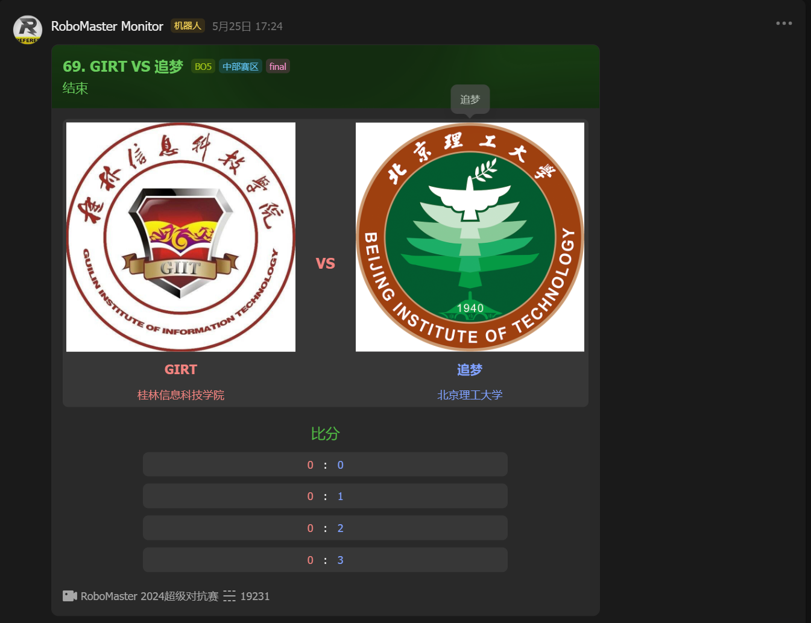
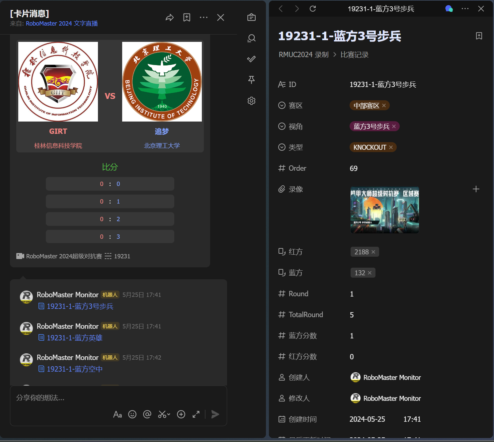
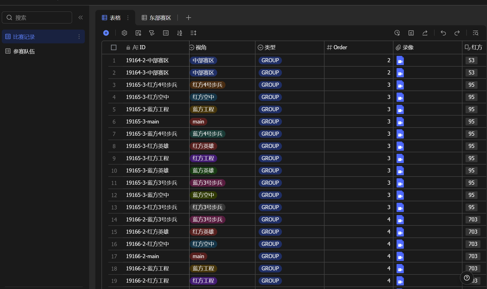

# RoboMaster 赛事监控系统

## Features
- 监控RoboMaster赛事事件
- 向飞书发送卡片推送
- 发送Webhook

## Example
### 监控-推送-录制一体化，高速复盘
> 更多功能需配合 `RoboMaster 赛事录制系统`





## Usage
### 编写配置文件
```yaml
spring: # Spring Boot 配置
  data:
    redis: # Redis 配置
      host: redis
  threads: 
    virtual:
      enabled: true # <可选> 打开虚拟线程
lark:
  enabled: true # 是否开启飞书通知模块
  appId: <Your App ID>
  appSecret: <Your App Secret>
  cardId: <Your Card ID>
dji:
  scanRate: "1000" # 扫描频率
webhook:
  enabled: true # 是否开启Webhook模块
  endpoints: []
```

#### 飞书通知模块
配置`lark.enabled`为`true`，并填写`appId`、`appSecret`、`cardId`。

前往[飞书开放平台](https://open.feishu.cn/)创建应用，获取`appId`、`appSecret`。

前往[飞书卡片搭建工具](https://open.feishu.cn/cardkit)创建卡片，获取`cardId`。 或使用我们的卡片 `AAqkpd7LuaV0s`。

#### Webhook模块
配置`webhook.enabled`为`true`, 填写`webhook.endpoints`为需要推送的Webhook地址。
##### Webhook格式
```json
{
  "type": "<Event Type>",
  "data": {
    "id": "18879",
    "round": 1,
    "totalRound": 3,
    "orderNumber": 33,
    "matchType": "GROUP",
    "blueSideId": "37880",
    "blueSide": {
      "id": "37880",
      "fillStatus": "PENDING",
      "fillSourceId": null,
      "fillSourceType": null,
      "fillSourceNumber": null,
      "playerId": null,
      "player": null
    },
    "redSideId": "37879",
    "redSide": {
      "id": "37879",
      "fillStatus": "PENDING",
      "fillSourceId": null,
      "fillSourceType": null,
      "fillSourceNumber": null,
      "playerId": null,
      "player": null
    },
    "redSideScore": 0,
    "blueSideScore": 0,
    "blueSideWinGameCount": 0,
    "planGameCount": 3,
    "planStartedAt": "2024-05-16T08:30:00Z",
    "redSideWinGameCount": 0,
    "winnerPlaceholdName": null,
    "loserPlaceholdName": null,
    "slug": null,
    "slugName": "4",
    "status": "WAITING",
    "zone": {
      "id": "498",
      "name": "东部赛区",
      "zoneType": "GROUP_ZONE",
      "eventId": "174",
      "event": {
        "id": "174",
        "title": "RoboMaster 2024超级对抗赛"
      }
    }
  }
}
```
`type`: 事件类型

| type                | 事件     |
|---------------------|--------|
| `match_start`       | 比赛开始   |
| `match_end`         | 比赛结束   |
| `match_session_end` | 比赛回合结束 |

`data`: 比赛数据

### 启动
#### 直接启动
将配置文件application.yml放置在jar包同目录下，执行
```shell
java -jar robomaster-monitor-xxx.jar
```

#### 使用Docker
docker-compose.yml
```yaml
networks:
  redis:
    external: true
services:
  monitor:
    image: ghcr.io/scutrobotlab/rm-monitor:latest
    restart: always
    networks:
      - redis
    volumes:
      - ./application.yml:/app/application.yml
    environment:
      TZ: Asia/Shanghai
```
> 或使用其他redis连接方案

执行
```shell
docker-compose up -d
```